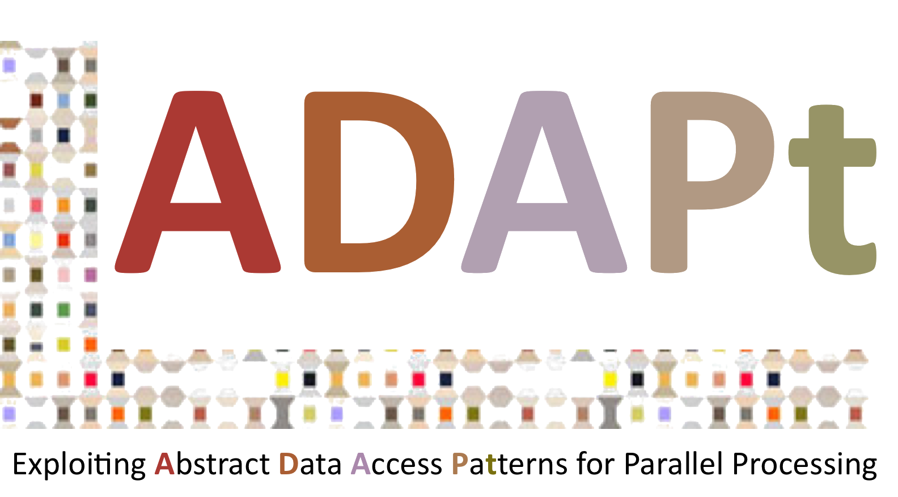
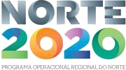
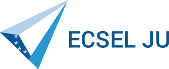
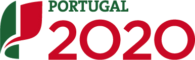

<!--
# Welcome to FACS 2022!

The 18th International Conference on Formal Aspects of Component Software will
take place on 10-11 November 2022. FACS 2022 will be an online conference
hosted by the University of Oslo, Norway.
 -->

<!-- # We are online! -->

<!-- See the program here: [Thursday](../2022/program/#thu), [Friday](../2022/program/#fri) -->

<!-- Zoom link for the presentations: [https://uio.zoom.us/j/64897891096?pwd=a2RzakgzMlFMWmJHVGRUcDVJNXY3UT09](https://uio.zoom.us/j/64897891096?pwd=a2RzakgzMlFMWmJHVGRUcDVJNXY3UT09){:target="_blank"} -->

<!-- Coffee breaks at wonder.me: [https://app.wonder.me/?spaceId=5076bfe7-29fe-45d9-b0f7-310381f4772a](https://app.wonder.me/?spaceId=5076bfe7-29fe-45d9-b0f7-310381f4772a){:target="_blank"} -->

# About FACS

The Formal Aspects of Component Software (FACS) conference series targets
research in formal approaches for distributed components and services. The
conferences cover topics including models, languages, analysis and
verification techniques for component-based systems such as service-oriented
architecture, cloud and edge computing, safety-critical, hybrid and cyber
physical systems, etc.

The 18th edition of FACS took place online on November 10-11 2022 and was organized by the University of Oslo.

### Proceedings

The proceedings are online at
[https://link.springer.com/book/10.1007/978-3-031-20872-0](https://link.springer.com/book/10.1007/978-3-031-20872-0){:target="_blank"}{:rel="noopener"}.

### Invited Speakers

  - [Christel Baier](../2022/speakers/christelbaier/), TU Dresden, Germany
  - [Renato Neves](../2022/speakers/renatoneves/), University of Minho, Portugal
  - [Ina Schaefer](../2022/speakers/inaschaefer/), Karlsruhe IT, Germany
  - [Volker Stolz](../2022/speakers/volkerstolz/), Western Norway University of Applied Science, Norway 

### Past Editions

- [FACS 2021](https://facs2021.inria.fr/){:target="_blank"}, Grenoble, France (online), October 28-29, 2021
- [FACS 2019](https://facs-conference.github.io/2019/){:target="_blank"}, Amsterdam, Netherlands, October 23-25, 2019
- [FACS 2018](http://sevlab.postech.ac.kr/facs18/){:target="_blank"}, Pohang, Korea, October 10-12, 2018
- [FACS 2017](http://facs2017.di.uminho.pt/){:target="_blank"}, Braga, Portugal, October 10-13, 2017
- [FACS 2016](http://events.femto-st.fr/facs2016/){:target="_blank"}, Besançon, France, October 19-21, 2016
- [FACS 2015](http://facs2015.ic.uff.br/){:target="_blank"}, Rio de Janeiro, Brasil, October 14-16, 2015
- [FACS 2014](http://facs2014.cs.unibo.it/index.html){:target="_blank"}, Bertinoro, Italy, September 10-12, 2014
- FACS 2013, Nanchang, China, October 28-30, 2013
- FACS 2012, Mountain View, USA, September 12-14, 2012
- [FACS 2011](http://facs2011.ifi.uio.no/){:target="_blank"}, Oslo, Norway, September 14-16, 2011
- [FACS 2010](http://www4.di.uminho.pt/facs2010/){:target="_blank"}, Guimarães, Portugal, October 14-16, 2010
- FACS 2009, Eindhoven, the Netherlands, November 2-3, 2009
- FACS 2008, Málaga, Spain, September 10-12, 2008
- FACS 2007, Sophia-Antipolis, France, September 19-21, 2007
- FACS 2006, Prague, September 20-22, 2006
- FACS 2005, Macao, October 24-25, 2005
- FACS 2003, Pisa, Italy, September 8-9, 2003

<!-- See publish.twitter.com, https://developer.twitter.com/en/docs/twitter-for-websites/timelines/guides/profile-timeline -->
<a class="twitter-timeline"  data-width="600" data-height="600" data-chrome="nofooter" dnt="true" href="https://twitter.com/facs_conf?ref_src=twsrc%5Etfw">Tweets by facs_conf</a>

# Support

{:style="text-align:center;"}
{:target="blank"}
{:target="blank"}
{:target="blank"}
{:target="blank"}

{:style="text-align:center;"}
{:target="blank"}
{:target="blank"}
{:target="blank"}
{:target="blank"}

{:style="text-align:center;"}
{:target="blank"}
{:target="blank"}
{:target="blank"}
{:target="blank"}

{:class="thanks"}
This event is supported by - the Norte Portugal Regional Operational Programme (NORTE 2020) under the Portugal 2020 Partnership Agreement, through ERDF – European Regional Development Fund through the Operational Programme for Competitiveness and Internationalisation (project NORTE-01-0145-FEDER-028550), - national funds through the Portuguese funding agency, FCT - Fundação para a Ciência e a Tecnologia (project PTDC/EEI-COM/28550/2017). The project has received funding from the ECSEL Joint Undertaking (JU) under grant agreement No 876852. The JU receives support from the European Union’s Horizon 2020 research and innovation programme and Austria, Czech Republic, Germany, Ireland, Italy, Portugal, Spain, Sweden, Turkey, - national funds through the Research Council of Norway, that is is funding the FRINATEK Young Research Talent Project ADAPt (No. 274515), and the SIRIUS Innovation centre (No. 237898).

{:class="thanks"}
Image credit: [Christoffer Engström](https://unsplash.com/photos/tjguVu0GoEM) via [Unsplash](https://unsplash.com)

